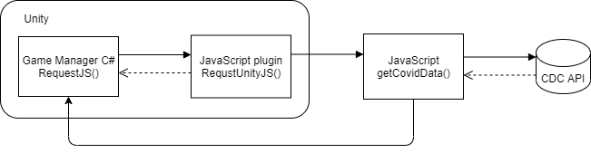

# 2020game

[Play Game](https://jmattick.github.io/2020game/Builds/index.html)

This project was created for the [Don't Panic!](https://dontpanic.cs.luc.edu/) Hackathon by Jessica Mattick. 
Jessica is a masters student in the computer science department at Loyola University Chicago 
graduating in May.

### Abstract

The goal of this project is to combine data visualization and game development. 
Game levels are generated from real-time daily COVID-19 data. Players can traverse a track and encounter game objects
that represent the fraction of new covid cases on each day in the dataset over the maximum new cases for selected 
U.S. states. Data is sourced from the [CDC COVID-19 Data Tracker](https://dev.socrata.com/foundry/data.cdc.gov/9mfq-cb36) API. 

### Platform

- Desktop / WebGL

### Development Tools / Languages

- Unity 2019.4.12f1
- C#
- JavaScript

### APIS

COVID-19 Data from CDC:

- [CDC COVID-19 Data Tracker](https://dev.socrata.com/foundry/data.cdc.gov/9mfq-cb36)

### Assets

Unity Assets: 

- [TextMeshPro](https://docs.unity3d.com/Manual/com.unity.textmeshpro.html)

### Development Process

**Accessing API data within Unity C# scripts**

While Unity has built-in C# [web request methods](https://docs.unity3d.com/Manual/webgl-networking.html), accessing
cross-domain resources in WebGL builds has restrictions. To solve this challenge, the data
was fetched from the api using Javascript. A diagram of the solution is shown below.

 

To preserve data throughout the entire game, a Game Manager object was created using a Singleton design pattern. 
A single instance of this object is created during the initial scene of the game 
and is not destroyed at any point in the game. The game manager stores the json string covid data from the api.

```csharp
using System.Collections;
using System.Collections.Generic;
using UnityEngine;
using System.Runtime.InteropServices;

public class GameManager : MonoBehaviour
{
    // store instance of game manager
    private static GameManager _instance;

    // string to hold covid json string from api
    private string covidData;

    // initialize Javascript method if run in WebGL build
#if UNITY_WEBGL && !UNITY_EDITOR
    [DllImport("__Internal")]
    private static extern void RequestUnityJS(string query);
#endif

    // game manager getter
    public static GameManager Instance
    {
        get
        {
            // create instance of game manager if does not exist
            if(_instance == null)
            {
                GameObject instance = new GameObject("Game Manager");
                instance.AddComponent<GameManager>();
            }

            return _instance;
        }
    }
    
    // method called on awake
    private void Awake()
    {
        _instance = this;
        covidData = "[]"; // set inital value for data
        RequestJS("IL"); // initially request data from Illinois
        DontDestroyOnLoad(this);
    }

    // method to set jsondata to be called from Javascript
    public void SetJsonData(string jsonString)
    {
        covidData = jsonString;
    }

    public string GetJsonData()
    {
        return covidData;
    }

    // unity method to call Javascript method (query is US state string)
    public void RequestJS(string query)
    {
        // if run in WebGL build call JS plugin method
#if UNITY_WEBGL && !UNITY_EDITOR
        RequestUnityJS(query);
#endif
    }
}

``` 

The game manager will call the RequestUnityJS() method in a javascript plugin within the unity project 
whenever new data is needed in the game. RequestUnityJS() will call the 
javascript function getCovidData() found in a script tag in index.html.

```javascript
var covidlib = {
	$dependencies:{},
	RequestUnityJS: function(query){
		getCovidData(UTF8ToString(query));
	}	
};
autoAddDeps(covidlib, '$dependencies');
mergeInto(LibraryManager.library,covidlib);
```

Finally, the getCovidData() method will fetch data from the CDC API and call the SetJsonData() C# method in the 
Game Manager with the json string as a parameter. 

```javascript
var unityInstance = UnityLoader.instantiate("unityContainer", "Build/Builds.json", {onProgress: UnityProgress});   

// method to fetch api 
var getCovidData = function(st) {
    var base_url = "https://data.cdc.gov/resource/9mfq-cb36.json?state=";
     
    fetch(base_url+st)
        .then(res => res.json())
        .then((out) => {
            // call SetJsonData in Game Manager
            unityInstance.SendMessage('Game Manager', 'SetJsonData', JSON.stringify(out));
    }).catch(err => console.error(err));
}
```

**Creating Game Levels from JSON data**

The next milestone was to convert the json string received from the api into a usable format for building levels. 
To do this, an API Handling C# script was created to get the data into the game. 
Unity's [JsonUtility.FromJson](https://docs.unity3d.com/ScriptReference/JsonUtility.FromJson.html) utility will 
return an object from its json representation. However, the data that comes from the api
is a json array, so a custom class representing the covid data as an object was created. Each daily datapoint can be 
represented as a DataPoint object that stores information about the date, the U.S. state, and the new cases on the date.

```csharp
// class to hold data about daily new cases
    [Serializable]
    public class DataPoint
    {
        public string submission_date;
        public string state;
        public float new_case;
    }
```

Next, the DataList object was created to store all of the data points in the dataset. For the purpose of the game, it is 
useful to sort the data points by submission date. The SortByDate() method strips any excess data from the 
submission_date string to sort the dataset in ascending order.

```csharp
// class to hold list of DataPoint objects
    [Serializable]
    public class DataList
    {
        public List<DataPoint> items;

        // method to sort items by submission date
        public void SortByDate()
        {
            // sort items
            items.Sort((a, b) => {
                // extract numerical date
                string date_a = a.submission_date.Substring(0, 10).Replace("-","");
                string date_b = b.submission_date.Substring(0, 10).Replace("-", "");

                // compare dates
                if (date_a.CompareTo(date_b)>0)
                {
                    return 1;
                } else
                {
                    return -1;
                }
            });
        }
    }
```

In order to provide a working game in the case the api fails to provide data, a backup json datafile is included
in the project. The GetAPIData() function will try to convert the provided json string into an object and will 
default to the json file in the case of an ArgumentException.

```csharp
// method to get data from API
    public DataList GetAPIData(string jsonString)
    {
        // initalize fianl json string compatible with DataList Class
        string jsonResponse;
        DataList res;
        // if no external data
        if (jsonString == "[]")
        {
            res = LoadBackupData();
        }
        else
        {
            try
            {
                // use provided json string
                jsonResponse = "{\"items\":" + jsonString + "}";
                // convert json response to DataList object
                res = JsonUtility.FromJson<DataList>(jsonResponse);
            }
            catch (System.ArgumentException ex)
            {
                Debug.Log(ex);
                res = LoadBackupData();
            }
        }
                
        return res;
    }

    // method loads data from backup json file
    public DataList LoadBackupData()
    {
        // load backup data from json file
        string jsonResponse = "{\"items\":" + jsonFile.text + "}";
        // convert json response to DataList object
        DataList res = JsonUtility.FromJson<DataList>(jsonResponse);
        return res;
    }
```

The DataList object created can then be used to generate game levels. 
A basic level containing a track, a player, and a starting and ending point was created in the Unity editor. 
A script was created to calculate the distance between the start and end point and evenly disperse the datapoints 
between them. At each datapoint, the track is labeled with the date and contains a number of objects that represent 
the fraction of new covid cases on that date. The player is able to move along the track to view the data and can 
interact with the objects at each datapoint. 

```csharp
using System.Collections;
using System.Collections.Generic;
using UnityEngine;
using TMPro;

// This script will add markers on the game track at equal intervals
public class MarkDays : MonoBehaviour
{
    // track marker prefab
    public Transform marker;
    // parent object of markers
    public Transform parent;
    // starting point object
    public Transform start;
    // ending point object
    public Transform end;
    // state marker object
    public TextMeshPro stateMarker;
    // enemy prefab
    public Transform enemy;
    // maximum number of objects per data point
    public float maxObjects = 10f;
    // string to hold api json data
    public string jsonData = "";
    // z offset betwen data points
    private float offset;
    // object to hold daily covid cases
    private HandleAPIs.DataList data;
    // list of datapoint labels
    private List<string> markerLabels;
    // max number of cases to calculate fraction of cases per day
    private float max_cases = 0f;
    // total number of days in dataset
    private int num_days;

    // Start is called before the first frame update
    void Start()
    {
      
        // get data
        jsonData = GameManager.Instance.GetJsonData();
        
        // get COVID data from API 
        data = GetComponent<HandleAPIs>().GetAPIData(jsonData);
        // sort data by submission date
        data.SortByDate();
        // count number of days in dataset
        num_days = data.items.Count;

        // change state marker text
        stateMarker.text = data.items[0].state;

        // initialize list to hold markers or dates to be used on track
        markerLabels = new List<string>();
 
        // loop through each item in dataset to format marker labels and find max value
        for (int i = 1; i < num_days; i++)
        {
            // set max_cases if new_cases is larger than currrent max
            if (data.items[i].new_case > max_cases)
            {
                max_cases = data.items[i].new_case;
            }
            // add formatted label to markerLabels
            markerLabels.Add(data.items[i].submission_date.Substring(0,10));
        }

        // length of track
        float gameLength = end.transform.position.z - start.transform.position.z;

        // calculate offset based on distance between start and end points
        offset = gameLength / (markerLabels.Count + 1);

        // loop through labels in list and create label on track
        for (int i = 0; i < markerLabels.Count; i++)
        {
            // newPos holds position of next marker label
            Vector3 newPos = start.transform.position + new Vector3(0f, 0f, offset * (i + 1));

            // enemyPosition holds position of next enemy 
            Vector3 enemyPos = newPos + new Vector3(0f, 10f, 4f);

            // multiple the fraction of new cases over max cases and multipy by max objects allowed 
            float maxNumItems = data.items[i].new_case / max_cases * maxObjects;
            
            // initalize marker clone
            Transform clone;

            // instatiate marker at next position
            clone = (Transform)Instantiate(marker, newPos, Quaternion.identity, parent);

            // update marker text
            clone.GetComponentInChildren<TextMeshPro>().text = markerLabels[i];

            // intantiate enemys at next enemy position
            for (int j = 0; j < maxNumItems; j++)
            {
                enemyPos += new Vector3(0f, 1f, 0f);
                Instantiate(enemy, enemyPos, Quaternion.identity);
            }
        }
    }
}

```

**Game UI**

Since the levels are created based on state data, a basic main menu was created containing a play button and a 
dropdown of all the states. The api is called every time the state dropdown value is changed to make sure that the 
data in the main game scene matches the menu. 

```csharp
using System.Collections;
using System.Collections.Generic;
using UnityEngine;
using UnityEngine.SceneManagement;
using UnityEngine.UI;
using TMPro;

public class MainMenu : MonoBehaviour
{
    // state dropdown
    public TMP_Dropdown stateDropdown;

    // list of states in data
    readonly List<string> usStates = new List<string>() { "AL", "AR", "AS", "AZ", "CA", "CO", "CT", "DE", "FL", "GA", "IA", "ID", "IL", "IN", "KY", "LA", "MA", "MD", "MI", "MN", "MS", "ND", "NE", "NM", "NV", "NY", "NYC", "OH", "OK", "PA", "PR", "RMI", "SC", "TN", "TX", "VA", "WA", "WI", "WV", "WY" };


    public void Awake()
    {
        GameManager.Instance.RequestJS("IL");
    }

    public void Start()
    {
        
        // clear any input in dropdown
        stateDropdown.ClearOptions();

        // loop through states and add options
        foreach (string st in usStates)
        {
            stateDropdown.options.Add(new TMP_Dropdown.OptionData() { text = st });
        }
        stateDropdown.value = 12;

        
    }
    public void PlayGame()
    {
        
        if (SceneManager.GetActiveScene().buildIndex == 2)
        {
            SceneManager.LoadScene(1);
        } else
        {
            SceneManager.LoadScene(SceneManager.GetActiveScene().buildIndex + 1);
        }
    }

    public void UpdateState()
    {
        GameManager.Instance.SetUSState(usStates[stateDropdown.value]);
        GameManager.Instance.RequestJS(usStates[stateDropdown.value]);
    }
}

```
 
### Demo

[Play Game](https://jmattick.github.io/2020game/Builds/index.html)


